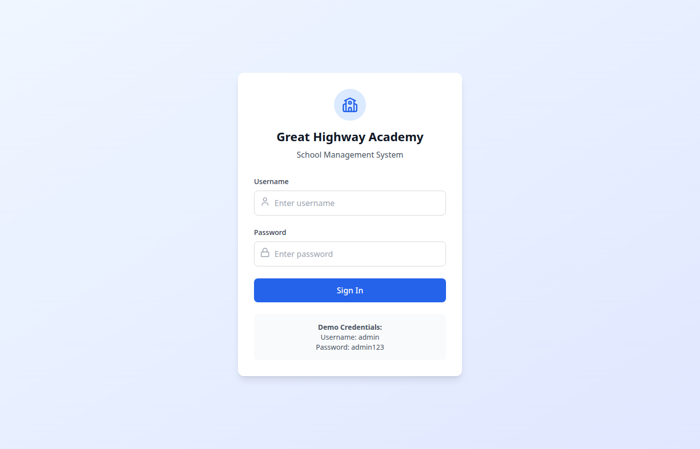
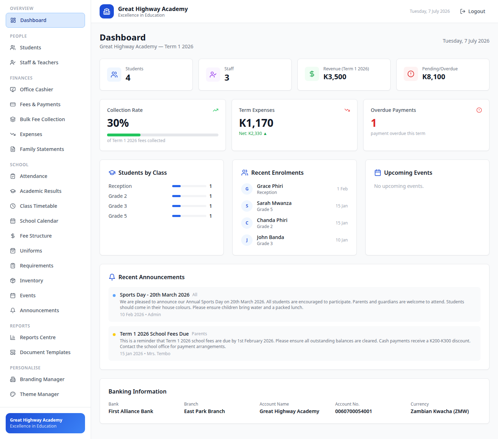

# Great Highway Academy — School Management System

A complete school administration system for **Great Highway Academy** (Lusaka, Zambia).
Manage students, fees, academics, staff, events, transport, uniforms and more — all in
one place, with cloud backup via Supabase.

> **Motto:** *The future starts today — a reader today, a leader tomorrow.*


## Screenshots

| Login | Dashboard |
|---|---|
|  |  |

---

## Public Website

The project now includes a public-facing school website for Great Highway Academy:

- **In the app:** unauthenticated visitors see a landing page (`src/components/LandingPage.tsx`)
  with the school's story, classes, fees and contact details; the **Portal Login** button
  opens the usual sign-in screen.
- **Standalone copy:** [`website/index.html`](website/index.html) is the same site as a single
  self-contained HTML file (plus `website/gha-logo.png`) that can be uploaded to any web host —
  see [`website/DEPLOYMENT.md`](website/DEPLOYMENT.md) for a step-by-step InterServer +
  custom-domain guide. It is also published with the app at `/website/` for previewing.
  `website/index.html` is the canonical copy — after editing it, copy it over
  `public/website/index.html`.

---

## Quick Start

```bash
npm install     # first time only
npm run dev     # starts the app — open the printed localhost address
```

**Default login:** username `admin`, password `admin123`
⚠️ Change this password after first login: *Settings → Users & Roles → edit Administrator*.

**Scripts**

```bash
npm run dev        # start the Vite dev server
npm run build      # production build (output in dist/)
npm run lint       # run ESLint
npm run typecheck  # TypeScript compiler with no emit
```

---

## Signing In & User Roles

The system supports multiple user accounts with different permission levels
(managed in *Settings → Users & Roles*, Admin only):

| Role | Can access |
|---|---|
| **Admin** | Everything, including Settings |
| **Cashier** | Finance sections — payments, cashier, debtors, uniforms, transport, fundraisers, reports |
| **Teacher** | Academic sections — attendance, results, timetable, calendar, events, announcements |
| **Viewer** | Read-only overview — dashboard, calendar, events, announcements |

The sidebar automatically shows only the sections the signed-in user may use.

---

## Sections Guide

### Overview
- **Dashboard** — live stats: enrolment, revenue (including fundraiser income), collection
  rate, overdue payments, academic performance, fundraiser fee tracker, upcoming events.

### People
- **Students** — enrol and manage pupils. The enrolment form includes guardian details
  and an optional **School Transport** route. Click a student for their full profile
  (payments, uniforms, requirements, academic history).
- **Staff & Teachers** — teacher records, roles and class assignments.

### Finances
- **Office Cashier** — fast front-desk payment capture.
- **Fees & Payments** — full payments ledger. Payment methods include Cash, **Mobile
  Money (MTN / Airtel / Zamtel)**, Bank Transfer and Cheque. Print official receipts.
- **Bulk Fee Collection** — capture fees for a whole class at once.
- **Debtors** — track people who owe the school for products or services: amount owed
  vs paid, due dates, partial payments, outstanding totals.
- **Expenses** — school spending by category and term.
- **Family Statements** — per-guardian statements across all their children.
- **Fundraisers** — create fundraising events (Sports Day, Aerobics Day, Graduation…),
  set a fee per person and collection window, **tick students as they pay**, and record
  contributions from **guests not on the system** (name, phone, amount). Totals roll up
  into Dashboard revenue and the Reports Centre. CSV export included.

### School
- **Attendance** — daily register per class with rates and history.
- **Academic Results** — enter marks per class/term/subject; automatic A–F grading and
  pass rates; print pupil slips and class reports.
- **Class Timetable** — weekly timetable per class.
- **School Calendar / Events** — term dates, holidays, meetings and all school events.
- **Transport** — bus routes with destination, monthly fee, driver and capacity.
  Assign students to routes (also possible from the student enrolment form).
- **Fee Structure** — tuition per grade (cash vs installments) plus other charges.
- **Uniforms** — two tabs: **Store** (sell to students — stock reduces automatically,
  sold-out items are blocked) and **Catalog & Prices** (add items, edit prices, set stock).
- **Requirements** — per-term items each family must provide.
- **Inventory** — school assets and supplies. Includes a synced, read-only view of
  uniform stock so the two sections always agree.
- **Announcements** — school-wide notices with priority levels.

### Reports
- **Reports Centre** — financial summary, class summary, student payment status,
  academic results and fundraiser reports. CSV export on every tab.
- **Document Templates** — print-ready official documents styled with the school's
  navy branding and crest watermark: payment receipt, family statement, admission
  letter, student ID card, certificate, attendance report, financial report, academic
  report card, and a **blank quotation form** matching the school's paper pad.

### Personalise
- **Branding Manager** — school name, motto, address, phone, bank details, logo.
  Every printed document pulls from here automatically.
- **Theme Manager** — five colour schemes plus dark mode.

### Maintenance (Admin only)
- **Settings → Users & Roles** — manage user accounts and their permissions.
- **Settings → Backup & Restore** — download all data as a JSON file / restore from one.
- **Settings → Cloud Sync** — see below.
- **Settings → Data Cleanup** — wipe selected sections, or a full system reset
  (guarded by a typed confirmation).

---

## Cloud Sync (Supabase)

All data lives in the browser's local storage. Cloud Sync keeps an off-site copy in the
school's Supabase project and lets you move between computers.

**One-time setup (already done for this school):** in the Supabase dashboard →
SQL Editor, run the SQL shown under *Settings → Cloud Sync → One-time setup*.

**Daily use:**
- **Push to Cloud** — upload this computer's data (replaces the cloud copy).
- **Pull from Cloud** — replace this computer's data with the cloud copy.
- **Auto-sync** — tick the box and every change is pushed automatically 10 seconds later.

> ⚠️ The cloud copy is one document — *last push wins*. If two computers are used at
> the same time, whoever pushes last overwrites the other. Use one "main" computer for
> data entry, or coordinate who works when. (True per-record live sync is a planned
> Phase 7 upgrade.)

**Golden rule:** download a local backup (*Settings → Backup & Restore*) before any
big change, and regularly — browser storage can be lost by clearing browsing data.

---

## Tech Stack

- **React 18 + TypeScript + Vite** — single-page app, no server required
- **Tailwind CSS** — styling, five theme colour schemes, dark mode
- **localStorage** — primary data store (per browser)
- **Supabase** (`@supabase/supabase-js`) — cloud backup/sync
- **lucide-react** — icons

### Project layout

```
src/
  components/     one file per section (Students, Payments, Fundraisers, Settings, …)
  context/
    AppContext    all school data + CRUD + persistence + backup/restore/wipe
    AuthContext   user accounts, roles, permissions
  hooks/
    useThemeClasses   theme colour classes
  lib/
    supabase.ts   cloud sync client and helpers
```

---

## Deployment

The repo includes a GitHub Actions workflow that builds and publishes the app to
**GitHub Pages** on every push to `main`. The live app runs entirely in the browser —
use *Cloud Sync → Pull* on first open to load the school's data.
